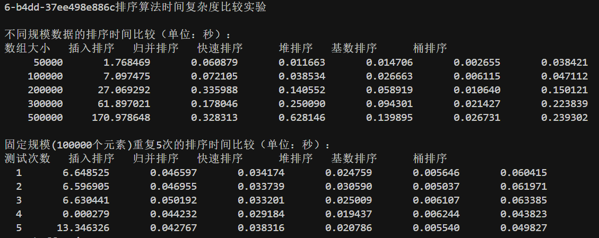

# 第一次实验报告  

## 实验目的
熟悉主要排序算法，对排序算法的时间复杂度及其影响因素有直观认识。

## 实验内容
1. 实现以下排序算法：
   - 插入排序
   - 归并排序
   - 快速排序
   - 堆排序
   - 基数排序
   - 桶排序

2. 进行性能测试：
   - 不同数组规模(5万、10万、20万、30万、50万)下的性能比较
   - 固定规模(10万)下打乱5次随机数据的性能比较(第4次为顺序，第5次为倒序)

3. 分析各排序算法的时间复杂度

## 实验结果分析

### 运行截图

### 性能测试数据

#### 不同规模数据的排序时间比较（单位：秒）

| 数组大小 | 插入排序 | 归并排序 | 快速排序 | 堆排序 | 基数排序 | 桶排序 |
|---------|----------|----------|----------|--------|----------|--------|
| 50000   | 1.768469 | 0.060879 | 0.011663 | 0.014706 | 0.002655 | 0.038421 |
| 100000  | 7.097475 | 0.072105 | 0.038534 | 0.026663 | 0.006115 | 0.047112 |
| 200000  | 27.069292| 0.335988 | 0.140552 | 0.058919 | 0.010640 | 0.150121 |
| 300000  | 61.897021| 0.178046 | 0.250090 | 0.094301 | 0.021427 | 0.223839 |
| 500000  | 170.978648| 0.328313| 0.628146 | 0.139895 | 0.026731 | 0.239302 |

#### 固定规模(100000个元素)重复5次的排序时间比较（单位：秒）

| 测试次数 | 插入排序 | 归并排序 | 快速排序 | 堆排序 | 基数排序 | 桶排序 |
|---------|----------|----------|----------|--------|----------|--------|
| 1(随机) | 6.648525 | 0.046597 | 0.034174 | 0.024759 | 0.005646 | 0.060415 |
| 2(随机) | 6.596905 | 0.046955 | 0.033739 | 0.030590 | 0.005037 | 0.061971 |
| 3(随机) | 6.630441 | 0.050192 | 0.033201 | 0.025009 | 0.006107 | 0.063385 |
| 4(顺序) | 0.000279 | 0.044232 | 0.029184 | 0.019437 | 0.006244 | 0.043823 |
| 5(倒序) | 13.346326| 0.042767 | 0.038316 | 0.020786 | 0.005540 | 0.049827 |

### 时间复杂度分析

1. 插入排序：
   - 理论时间复杂度：最好O(n)，平均和最坏O(n²)
   - 实验数据分析：
     * 随机数据：时间增长明显呈二次曲线，与理论复杂度O(n²)相符
     * 顺序数据：仅需0.000279秒，验证了最优情况下O(n)的复杂度
     * 倒序数据：耗时最长，达到13.346秒，体现最坏情况O(n²)
   - 数据规模影响：从5万到50万，时间从1.77秒增加到170.98秒，增长约100倍

2. 归并排序：
   - 理论时间复杂度：O(nlogn)
   - 实验数据分析：
     * 各种数据分布下表现稳定，时间波动小
     * 数据规模从5万到50万（10倍），时间从0.06秒增加到0.33秒（约5.5倍）
     * 增长率低于线性，符合nlogn的特征
   - 空间开销：需要额外O(n)的空间，但时间效率好

3. 快速排序：
   - 理论时间复杂度：平均O(nlogn)，最坏O(n²)
   - 实验数据分析：
     * 随机数据：表现优异，50万数据仅需0.63秒
     * 顺序和倒序数据：性能略有下降但仍然保持高效
     * 数据规模增大时性能退化相对温和
   - 优化建议：可考虑采用三数取中法选择枢轴

4. 堆排序：
   - 理论时间复杂度：O(nlogn)
   - 实验数据分析：
     * 性能稳定，不受输入数据分布影响
     * 50万数据处理时间0.14秒，增长曲线平滑
     * 各种数据分布下波动很小，显示了算法的稳定性

5. 基数排序：
   - 理论时间复杂度：O(d(n+k))，d为位数，k为基数
   - 实验数据分析：
     * 表现最佳，50万数据仅需0.027秒
     * 时间增长近似线性，验证了线性时间复杂度
     * 对数据分布不敏感，5次测试时间波动很小
   - 局限性：仅适用于整数或可转换为整数的数据

6. 桶排序：
   - 理论时间复杂度：平均O(n+k)，k为桶数量
   - 实验数据分析：
     * 性能仅次于基数排序
     * 时间随数据规模增长呈现线性趋势
     * 50万数据处理时间0.24秒，效率很高
   - 优化空间：可通过调整桶的数量和分布进一步优化

### 综合分析与建议

1. 算法选择建议：
   - 小规模数据（<1000）：插入排序简单高效
   - 中等规模：快速排序或归并排序
   - 大规模数据：基数排序或桶排序（如果适用）
   - 对稳定性要求高：归并排序或基数排序
   - 内存受限：堆排序（原地排序）

2. 性能优化方向：
   - 快速排序：改进枢轴选择策略
   - 桶排序：优化桶的划分策略
   - 基数排序：针对数据范围调整基数
   - 考虑混合策略：大规模用快排，小规模改用插入排序

3. 实际应用考虑因素：
   - 数据规模
   - 数据分布特征
   - 内存限制
   - 稳定性要求
   - 是否需要原地排序

## 完成时间
2024年3月18日

## 文件结构
- `Sort.cpp`: 包含所有排序算法的实现
- `main.cpp`: 测试程序入口
- `README.md`: 项目说明文档