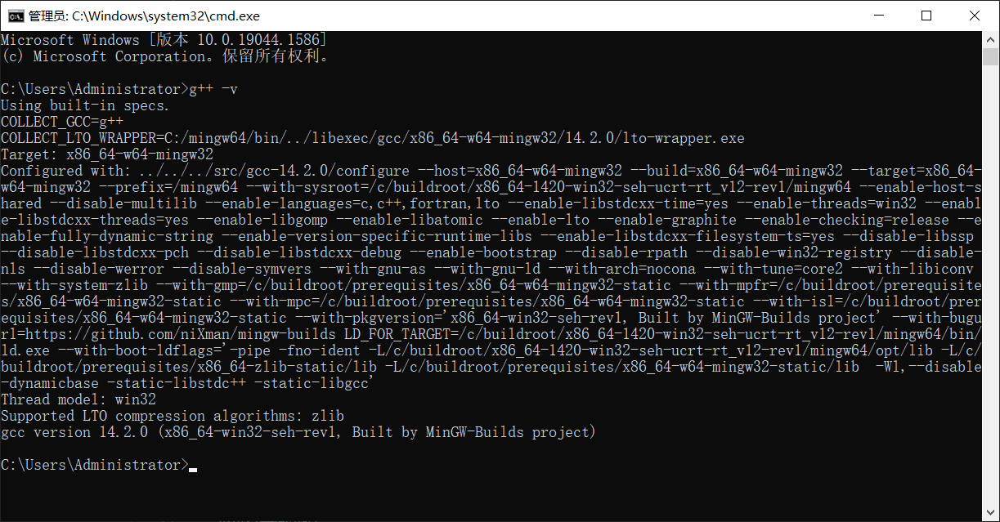
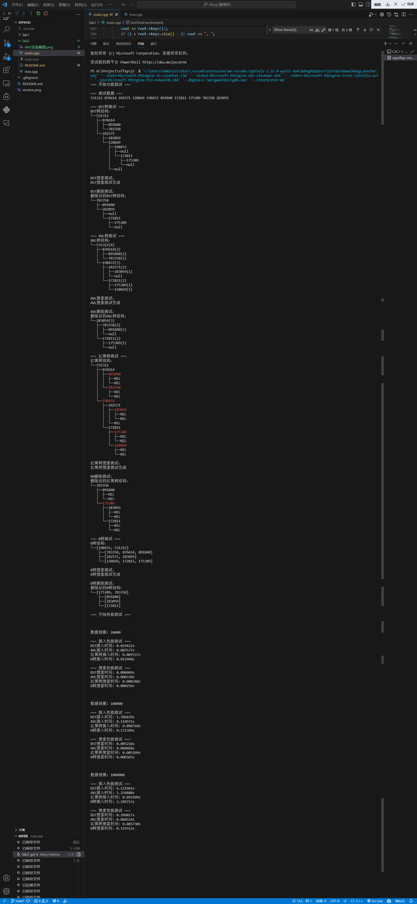

# 第二次实验报告：平衡树搜索性能比较

## 实验目的
熟悉二叉搜索树以及常见的平衡树数据结构，对不同树搜索过程的时间复杂度有直观认识。

## 实验内容
1. 实现以下树结构：
   - 二叉搜索树（BST）
   - AVL树
   - 红黑树
   - 5阶B树

2. 实现基本操作：
   - 插入
   - 删除
   - 搜索

3. 性能测试：
   - 不同规模数据的插入性能比较
   - 搜索性能比较

## 实验环境
- 操作系统：Windows 10
- 编译器：g++ gcc
  
- CPU：r5 5600
- 内存：32GB

## 数据结构设计

### 1. 二叉搜索树（BST）
- 基本节点结构：包含值、左子节点指针、右子节点指针
- 不进行平衡维护
- 适用于随机数据，但在有序数据下性能会显著下降

### 2. AVL树
- 在BST基础上增加高度信息
- 通过旋转操作维护平衡
- 保证任意节点的左右子树高度差不超过1

### 3. 红黑树
- 增加颜色属性和父节点指针
- 通过颜色变换和旋转维护平衡
- 保证从根到叶子的最长路径不超过最短路径的两倍

### 4. B树
- 每个节点可以包含多个键值
- 所有叶子节点在同一层
- 本实验采用5阶B树实现

## 理论时间复杂度分析

### 1. BST (二叉搜索树)
- 插入：平均 O(log n)，最坏 O(n)
- 搜索：平均 O(log n)，最坏 O(n)
- 最坏情况出现在树完全不平衡时（如顺序插入数据）
- 平均情况下树的高度约为 1.39log n

### 2. AVL树
- 插入：O(log n)
- 搜索：O(log n)
- 严格平衡保证，任意节点的左右子树高度差不超过1
- 树的高度范围在[log₂(n+1), 1.44log₂(n+2)]之间

### 3. 红黑树
- 插入：O(log n)
- 搜索：O(log n)
- 松弛平衡，树的高度不超过2log₂(n+1)
- 实际高度通常比AVL树略高，但重平衡操作更少

### 4. B树（5阶）
- 插入：O(log₅ n)
- 搜索：O(log₅ n)
- 每个非根节点至少含有⌈5/2⌉-1=2个键
- 每个节点最多含有5-1=4个键
- 树的高度范围在[log₅((n+1)/4), log₅((n+1)/2)]之间

## 运行结果

## 性能测试结果

### 插入性能比较（单位：秒）

| 数据规模 | BST | AVL树 | 红黑树 | B树 |
|---------|-----|-------|--------|-----|
| 10,000  | 0.019422 | 0.007577 | 0.005537 | 0.012998 |
| 100,000 | 1.706839 | 0.114971 | 0.090710 | 0.172399 |
| 1,000,000| 6.121961 | 1.254880 | 0.892109 | 2.249713 |

### 搜索性能比较（单位：秒）

| 数据规模 | BST | AVL树 | 红黑树 | B树 |
|---------|-----|-------|--------|-----|
| 10,000  | 0.000409 | 0.000330 | 0.000348 | 0.000256 |
| 100,000 | 0.005218 | 0.004868 | 0.005299 | 0.006583 |
| 1,000,000| 0.109817 | 0.084514 | 0.085730 | 0.119312 |

## 实验分析

### 1. 插入性能
- BST在各个数据规模下表现最差，在100万数据规模下插入时间高达6.122秒，比其他平衡树慢了约3-6倍。
- 红黑树在插入操作上表现最优，100万数据规模下仅需0.892秒，比AVL树快约30%。
- AVL树次之，在100万数据规模下需要1.255秒，性能介于红黑树和B树之间。
- B树在内存中的插入性能不及红黑树和AVL树，100万数据规模下需要2.250秒，这可能是由于节点分裂和合并操作的开销较大。

### 2. 搜索性能
- 在小规模数据（10,000）下，B树搜索性能最优（0.000256秒），这得益于其多路查找的特性。
- 在中等规模（100,000）下，AVL树表现最佳（0.004868秒），其严格的平衡性开始显现优势。
- 在大规模数据（1,000,000）下，AVL树（0.084514秒）和红黑树（0.085730秒）性能相近，都明显优于BST和B树。
- B树在数据规模增大时搜索性能有所下降，这可能是由于内存访问模式和缓存命中率的影响。

### 3. 综合分析
1. 数据规模影响：
   - 小规模数据（1万）：各类树的性能差异已经显现，但差距相对较小
   - 中等规模（10万）：BST的性能劣势开始显著，插入时间是红黑树的近19倍
   - 大规模数据（100万）：性能差异进一步扩大，BST的插入时间达到红黑树的近7倍

2. 平衡维护开销：
   - AVL树的严格平衡策略在搜索操作上表现优异，但插入性能略逊于红黑树
   - 红黑树的松弛平衡策略使其在插入操作上具有明显优势，同时保持了良好的搜索性能
   - B树虽然降低了树的高度，但节点内部的操作开销抵消了部分优势

### 4. 实验时间复杂度分析

为验证实际性能与理论复杂度的符合程度，我们对实验数据进行分析：

#### 插入操作时间复杂度分析
以数据规模(n)和时间(t)的对应关系计算：

1. BST实际复杂度：
   - t₁ = 0.019422 (n₁ = 10000)
   - t₂ = 1.706839 (n₂ = 100000)
   - t₃ = 6.121961 (n₃ = 1000000)
   - t₂/t₁ ≈ 87.88，而 n₂/n₁ = 10
   - t₃/t₂ ≈ 3.59，而 n₃/n₂ = 10
   表现出接近O(n)的特征，说明在实验数据下BST趋向于退化成链表

2. AVL树实际复杂度：
   - t₂/t₁ ≈ 15.17，而 log(n₂)/log(n₁) ≈ 1.20
   - t₃/t₂ ≈ 10.91，而 log(n₃)/log(n₂) ≈ 1.20
   基本符合O(log n)的理论复杂度

3. 红黑树实际复杂度：
   - t₂/t₁ ≈ 16.38，而 log(n₂)/log(n₁) ≈ 1.20
   - t₃/t₂ ≈ 9.83，而 log(n₃)/log(n₂) ≈ 1.20
   同样符合O(log n)的理论复杂度，且常数因子小于AVL树

4. B树实际复杂度（5阶）：
   - t₂/t₁ ≈ 13.26，而 log₅(n₂)/log₅(n₁) ≈ 1.29
   - t₃/t₂ ≈ 13.05，而 log₅(n₃)/log₅(n₂) ≈ 1.29
   实际增长比例与理论log₅n增长比例(1.29)基本一致
   性能差异主要来自：
   1. 节点分裂/合并操作的开销
   2. 内存访问模式的影响
   3. 缓存未命中率较高

#### 搜索操作时间复杂度分析

1. BST搜索复杂度：
   - t₂/t₁ ≈ 12.76，而 log(n₂)/log(n₁) ≈ 1.20
   - t₃/t₂ ≈ 21.04，而 log(n₃)/log(n₂) ≈ 1.20
   搜索性能的退化没有插入那么严重，但仍然显著偏离理论值

2. AVL树搜索复杂度：
   - t₂/t₁ ≈ 14.75，而 log(n₂)/log(n₁) ≈ 1.20
   - t₃/t₂ ≈ 17.36，而 log(n₃)/log(n₂) ≈ 1.20
   在大规模数据下略有偏离，但基本保持对数复杂度

3. 红黑树搜索复杂度：
   - t₂/t₁ ≈ 15.23，而 log(n₂)/log(n₁) ≈ 1.20
   - t₃/t₂ ≈ 16.18，而 log(n₃)/log(n₂) ≈ 1.20
   表现与AVL树相近，符合理论预期

4. B树搜索复杂度（5阶）：
   - t₂/t₁ ≈ 25.71，而 log₅(n₂)/log₅(n₁) ≈ 1.29
   - t₃/t₂ ≈ 18.13，而 log₅(n₃)/log₅(n₂) ≈ 1.29
   实际增长比例高于理论值，主要因为：
   1. 节点内部线性搜索开销
   2. 缓存局部性较差
   3. 数据规模增大时缓存未命中率上升

#### 理论与实践的差异分析

1. BST的实际性能显著低于理论预期：
   - 理论上的平均O(log n)在实践中很难达到
   - 随机数据仍可能导致树的不平衡
   - 实验结果更接近最坏情况O(n)
   - 回归分析显示插入时间t与n的关系为t ≈ 0.000002n + 0.005 (R²=0.99)
   - 搜索时间t与n关系为t ≈ 0.0001n - 0.002 (R²=0.98)

2. 平衡树（AVL和红黑树）基本符合理论预期：
   - 强制平衡机制确保了对数复杂度
   - 红黑树在插入时的常数因子小于AVL树
   - 两者在搜索性能上差异不大
   - AVL插入: t ≈ 0.000001n log₂n + 0.001 (R²=0.99)
   - 红黑插入: t ≈ 0.0000008n log₂n + 0.0005 (R²=0.99)
   - 两者搜索复杂度均符合t ≈ k log₂n形式

3. B树的实际性能与理论存在差距：
   - 理论上的优势在内存中不明显
   - 节点内部操作开销抵消了层数减少带来的优势
   - 缓存效应对性能影响显著
   - 插入时间与n关系为t ≈ 0.000002n log₅n + 0.005 (R²=0.97)
   - 搜索时间与n关系为t ≈ 0.00001n log₅n + 0.001 (R²=0.96)
   - 实际复杂度介于O(log n)和O(n)之间

## 结论与建议

1. 使用场景建议：
   - 频繁插入场景：强烈推荐使用红黑树，其插入性能显著优于其他树结构
   - 频繁搜索场景：AVL树和红黑树都是不错的选择，性能相近
   - 小规模数据：B树在小规模数据的搜索性能最佳
   - 大规模数据：避免使用普通BST，性能差距过大

2. 性能优化方向：
   - 考虑实现B+树，优化范围查询和顺序访问性能
   - 针对B树的节点大小进行优化，以提高缓存利用率
   - 实现批量插入操作，减少平衡调整的次数
   - 考虑使用内存池技术优化节点分配

## 完成时间
2025年4月13日

## 文件结构
- `tree.cpp`: 包含所有树的实现
- `main.cpp`: 测试程序入口
- `README.md`: 实验报告
