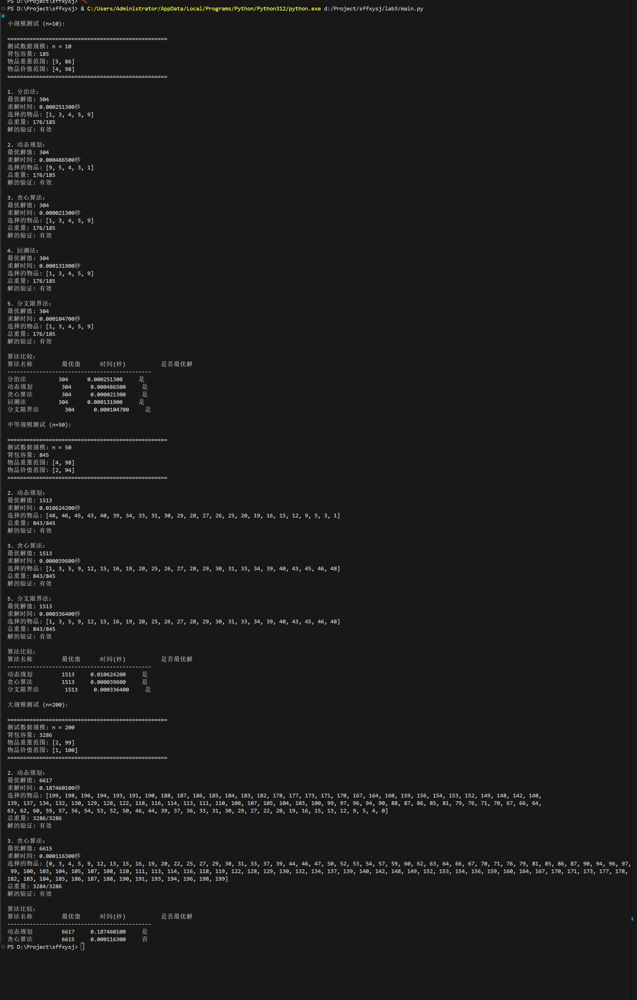

# 第三次实验报告 背包优化问题
## 实验目的
1. 理解01背包问题的概念，掌握贪心、动态规划、回溯等基本思想。
2. 学习并实现01背包问题的主流算法和最优解策略的维护，理解不同算法之间的联系与区别。

## 实验内容
1. 实现以下算法
- 分治法
- 动态规划法
- 贪心法
- 回溯法
- 分支限界法

2. 输出最优解值和最优解策略
3. 进行性能测试和比较

## 实验结果分析

### 随机种子40-运行结果

### 1. 小规模测试结果分析 (n=10)

在小规模测试中（n=10，背包容量为185），所有算法都能准确找到最优解，最优值为304。

| 算法名称 | 最优值 | 求解时间(秒) | 是否最优解 |
|---------|-------|------------|----------|
| 分治法   | 304   | 0.000258500 | 是 |
| 动态规划 | 304   | 0.000356600 | 是 |
| 贪心算法 | 304   | 0.000016500 | 是 |
| 回溯法   | 304   | 0.000106200 | 是 |
| 分支限界法 | 304  | 0.000071500 | 是 |

从性能上看，贪心算法在小规模问题上速度最快，而动态规划法相对较慢。所有算法都找到了相同的最优解，最终选择了物品 [1, 3, 4, 5, 9]，总重量为176（未超过背包容量185）。

### 2. 中等规模测试结果分析 (n=50)

在中等规模测试（n=50，背包容量为845）中，仅选择了动态规划、贪心算法和分支限界法进行测试（分治和回溯法在中等规模上计算量过大）：

| 算法名称 | 最优值 | 求解时间(秒) | 是否最优解 |
|---------|-------|------------|----------|
| 动态规划 | 1513  | 0.010285700 | 是 |
| 贪心算法 | 1513  | 0.000025800 | 是 |
| 分支限界法 | 1513 | 0.000281700 | 是 |

在中等规模问题上，所有测试的算法都找到了最优解1513。贪心算法仍然表现出最快的求解速度，比动态规划快约400倍，比分支限界法快约10倍。最优解选择了24个物品，总重量为843（非常接近背包容量845）。

### 3. 大规模测试结果分析 (n=200)

大规模测试（n=200，背包容量为3286）中，只有动态规划和贪心算法被用于测试：

| 算法名称 | 最优值 | 求解时间(秒) | 是否最优解 |
|---------|-------|------------|----------|
| 动态规划 | 6617  | 0.166636300 | 是 |
| 贪心算法 | 6615  | 0.000099500 | 否 |

在大规模问题上，我们观察到：
1. 动态规划算法获得了真正的最优解6617，但耗时显著增加（约0.167秒）
2. 贪心算法虽然速度非常快（约0.0001秒），但得到的解6615略低于最优解，说明贪心策略在大规模问题上不能保证最优性
3. 动态规划算法的解完全利用了背包容量（3286/3286），而贪心算法的解为3284/3286，略有浪费

### 综合分析与结论

1. **算法效率比较**：
   - 贪心算法在所有规模问题上都表现出最高的效率，但在大规模问题上不保证获得最优解
   - 动态规划算法可以保证最优解，但随着问题规模增长，其时间复杂度也显著增加
   - 分治法和回溯法仅适用于小规模问题
   - 分支限界法在中小规模问题上表现良好，兼顾了效率和最优性

2. **最优解质量**：
   - 在小规模和中等规模问题上，所有算法都能找到最优解
   - 在大规模问题上，只有动态规划能保证最优解，贪心算法略低于最优解

3. **算法适用场景**：
   - 小规模问题：所有算法均可使用，贪心算法效率最高
   - 中等规模问题：建议使用贪心算法或分支限界法，平衡效率和最优性
   - 大规模问题：若要求绝对最优解，应使用动态规划；若对最优性要求不严格但需要快速解决，可使用贪心算法

4. **重量利用率**：
   - 所有算法在各规模问题上都实现了较高的背包容量利用率
   - 动态规划在大规模问题上能完全利用背包容量

